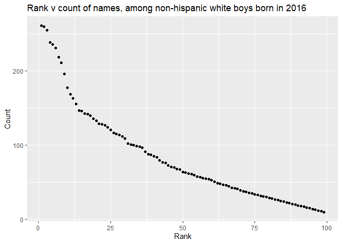

HW 2
================
Sam Loewen
9/27/2019

## Problem 1

First I will read and clean the Mr. Trash Wheel sheet:

  - specify the sheet in the Excel file and to omit non-data entries
    (rows with notes / figures; columns containing notes) using
    arguments in read\_excel
  - use reasonable variable names
  - omit rows that do not include dumpster-specific data
  - round the number of sports balls to the nearest integer and converts
    the result to an integer variable (using as.integer)

<!-- end list -->

``` r
trash_wheel = 
  read_excel("./data/Trash-Wheel-Collection-Totals-8-6-19.xlsx", sheet = 1, skip = 1) %>% 
  janitor::clean_names() %>% 
  drop_na(dumpster) %>% 
  select(-x15, -x16, -x17) %>% 
  mutate(sports_balls = as.integer(sports_balls))
```

    ## New names:
    ## * `` -> ...15
    ## * `` -> ...16
    ## * `` -> ...17

Next I will read and clean precipitation data for 2017 and 2018. For
each omit rows without precipitation data and add a variable year. Next,
combine precipitation datasets and convert month to a character variable
(the variable month.name is built into R and should be useful).

``` r
precip_17 = 
  read_excel("./data/Trash-Wheel-Collection-Totals-8-6-19.xlsx", sheet = 6, skip = 1) %>% 
  janitor::clean_names() %>% 
  drop_na() %>% 
  mutate(year = 2017) %>% 
  select(year, month, total)

precip_18 = 
  read_excel("./data/Trash-Wheel-Collection-Totals-8-6-19.xlsx", sheet = 5, skip = 1) %>% 
  janitor::clean_names() %>% 
  drop_na() %>% 
  mutate(year = 2018) %>% 
  select(year, month, total)

precip_all = 
  full_join(precip_17, precip_18) %>% 
  mutate(month = month.name[month])
```

    ## Joining, by = c("year", "month", "total")

My trash\_wheel data set has 344 observations, and my precip\_all data
set has 24 observations. Trash\_wheel includes variables to show the
number of items removed from the harbor, such as `glass_bottles` and
`grocery_bags`. We can also see that the total number of `sports_balls`
in the dumpster in 2017 was 530. The precip\_all dataframe can show us
that the total precipitation in 2018 was 70.33 inches.

## Problem 2

First, clean the data in pols-month.csv. Use separate() to break up the
variable mon into integer variables year, month, and day; replace month
number with month name; create a president variable taking values gop
and dem, and remove prez\_dem and prez\_gop; and remove the day
variable.

``` r
pols =
  read_csv("./data/pols-month.csv") %>%
  janitor::clean_names() %>% 
  separate(mon, c("year", "month", "day")) %>%
  mutate(prez = ifelse(prez_gop == 1, "gop", "dem")) %>% 
  mutate(year = as.numeric(year), month = as.numeric(month)) %>% 
  select (-prez_gop, -prez_dem, -day)
```

    ## Parsed with column specification:
    ## cols(
    ##   mon = col_date(format = ""),
    ##   prez_gop = col_double(),
    ##   gov_gop = col_double(),
    ##   sen_gop = col_double(),
    ##   rep_gop = col_double(),
    ##   prez_dem = col_double(),
    ##   gov_dem = col_double(),
    ##   sen_dem = col_double(),
    ##   rep_dem = col_double()
    ## )

Second, clean the data in snp.csv using a similar process to the above.
For consistency across datasets, arrange according to year and month,
and organize so that year and month are the leading columns.

``` r
snp =
  read_csv("./data/snp.csv") %>%
  janitor::clean_names() %>% 
  separate(date, c("month", "day", "year")) %>% 
  mutate(year = as.numeric(year), month = as.numeric(month)) %>% 
  select (year, month, -day, close) %>% 
  arrange (year, month)
```

    ## Parsed with column specification:
    ## cols(
    ##   date = col_character(),
    ##   close = col_double()
    ## )

Third, tidy the unemployment data so that it can be merged with the
previous datasets. This process will involve switching from “wide” to
“long” format; ensuring that key variables have the same name; and
ensuring that key variables take the same values.

``` r
unemp=
  read_csv("./data/unemployment.csv") %>% 
  janitor::clean_names() %>% 
  pivot_longer(
    jan:dec, 
    names_to = "month", 
    values_to = "snp") %>% 
  mutate(
    month = replace(month, month == "jan", "1"),
    month = replace(month, month == "feb", "2"),
    month = replace(month, month == "mar", "3"),
    month = replace(month, month == "apr", "4"),
    month = replace(month, month == "may", "5"),
    month = replace(month, month == "jun", "6"),
    month = replace(month, month == "jul", "7"),
    month = replace(month, month == "aug", "8"),
    month = replace(month, month == "sep", "9"),
    month = replace(month, month == "oct", "10"),
    month = replace(month, month == "nov", "11"),
    month = replace(month, month == "dec", "12"),
    month = as.numeric(month))
```

    ## Parsed with column specification:
    ## cols(
    ##   Year = col_double(),
    ##   Jan = col_double(),
    ##   Feb = col_double(),
    ##   Mar = col_double(),
    ##   Apr = col_double(),
    ##   May = col_double(),
    ##   Jun = col_double(),
    ##   Jul = col_double(),
    ##   Aug = col_double(),
    ##   Sep = col_double(),
    ##   Oct = col_double(),
    ##   Nov = col_double(),
    ##   Dec = col_double()
    ## )

Join the datasets by merging snp into pols, and merging unemployment
into the result.

``` r
q2_merge =
  left_join(pols, snp, by = c("year","month"))

final_db = 
  left_join(q2_merge,unemp, by =c("year","month"))
```

These datasets provide information on who was in power by month starting
in the late 1940s and early 50s including `snp` and `close` data,
although I don’t know what those are. The resulting database `final_db`
combines all these datasets to show variables such as number of senators
per party (`sen_dem` and `sen_gop`), the political part of the president
(`prez`) and `snp`, and `close` data. The databases has 822 observations
and covers January 1947 to June 2015.

## Problem 3

Load and tidy the data. Note that, although these data may seem fairly
well formatted initially, the names of a categorical predictor and the
case structure of string variables changed over time; you’ll need to
address this in your data cleaning. Also, some rows seem duplicated, and
these will need to be removed (hint: google something like “dplyr remove
duplicate rows” to get started).

``` r
baby_names = 
  read_csv("./data/Popular_Baby_Names.csv") %>% 
  janitor::clean_names() %>% 
  mutate(
    ethnicity = replace(ethnicity, ethnicity == "ASIAN AND PACI", "ASIAN AND PACIFIC ISLANDER"),
    ethnicity = replace(ethnicity, ethnicity == "BLACK NON HISP", "BLACK NON HISPANIC"),
    ethnicity = replace(ethnicity, ethnicity == "WHITE NON HISP", "WHITE NON HISPANIC"), 
    childs_first_name = toupper(childs_first_name)) %>% 
  distinct()
```

    ## Parsed with column specification:
    ## cols(
    ##   `Year of Birth` = col_double(),
    ##   Gender = col_character(),
    ##   Ethnicity = col_character(),
    ##   `Child's First Name` = col_character(),
    ##   Count = col_double(),
    ##   Rank = col_double()
    ## )

Produce a well-structured, reader-friendly table showing the rank in
popularity of the name “Olivia” as a female baby name over time; this
should have rows for ethnicities and columns for year. Produce a similar
table showing the most popular name among male children over time.

``` r
#olivia
baby_names_o =
  baby_names %>%  
  filter(childs_first_name == "OLIVIA") %>% 
  pivot_wider(
    names_from = "year_of_birth",
    values_from = "rank") %>% 
  select (-gender, -childs_first_name, -count)

#boy names
baby_names_boy = 
  baby_names %>%
  filter(gender == "MALE") %>% 
  pivot_wider(
    names_from = "year_of_birth",
    values_from = "rank") %>% 
  select (-gender, -count)
```

Finally, for male, white non-hispanic children born in 2016, produce a
scatter plot showing the number of children with a name (y axis) against
the rank in popularity of that name (x axis).

``` r
scatter_names =
  baby_names %>% 
  filter (gender == "MALE", ethnicity == "WHITE NON HISPANIC", year_of_birth == 2016)

scatter_names %>% 
  ggplot(aes(x = rank, y = count)) + 
  geom_point() +
    labs(title = "Rank v count of names, among non-hispanic white boys born in 2016", 
    x = "Rank", 
    y = "Count")
```

<!-- -->
